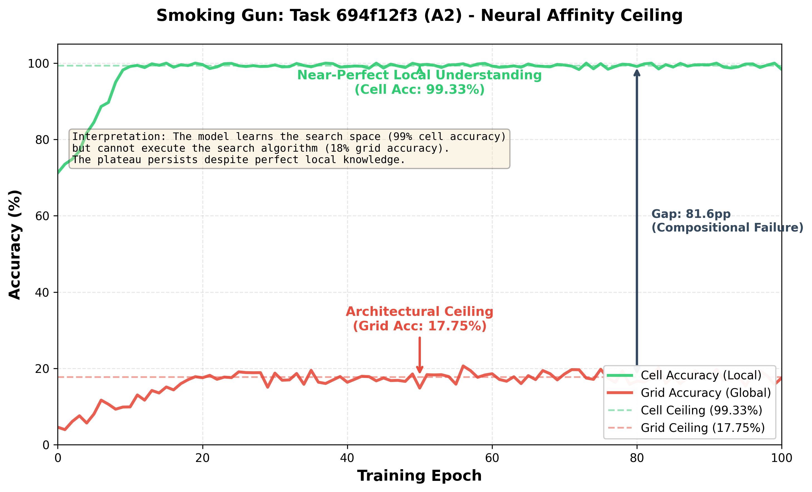

# Neural Affinity Framework for ARC - Official Package

[](https://github.com/ImmortalDemonGod/arc-taxonomy-reproduction/actions/workflows/ci.yml)
[](https://www.python.org/downloads/)
[](./LICENSE)
[](./Ingram_Merrit_2025_Neural_Affinity_Framework_ARC.pdf)
[](#-reproducing-key-results)

**Paper:** Ingram & Merritt (2025) - *A Neural Affinity Framework for Abstract Reasoning: Diagnosing the Compositional Gap in Transformer Architectures via Procedural Task Taxonomy*  
**Status:** Artifact Evaluated & Reproduction-Ready

---

<table>
  <tr>
    <td width="25%" align="center">
      <a href="QUICKSTART.md"><b>🚀 Quick Start</b></a>
    </td>
    <td width="25%" align="center">
      <a href="APPLYING_TO_YOUR_MODEL.md"><b>🔧 Apply to Your Model</b></a>
    </td>
    <td width="25%" align="center">
      <a href="LICENSE"><b>⚖️ License (MIT)</b></a>
    </td>
    <td width="25%" align="center">
      <a href="Ingram_Merrit_2025_Neural_Affinity_Framework_ARC.pdf"><b>📄 Paper PDF</b></a>
    </td>
  </tr>
</table>

---

## What is this?

This repository serves two main use cases:

1. **Verify the paper** — independently check all empirical claims without reading 61 pages or training models.
2. **Diagnose your ARC model** — evaluate new architectures by category (neural affinity), compositional gap, and curriculum design.

We provide:

1. **Pre-computed results** from 302 fine-tuning experiments (no GPU needed)
2. **Verification scripts** that check the paper's statistics are correct
3. **Complete training code** if you want to reproduce from scratch (GPU required)

**Target audience:**
- Researchers wanting to verify our "Compositional Gap" (69.5% of tasks fail composition) and "Neural Affinity Ceiling" (42.9% of hard tasks stuck at 0%) claims.
- Researchers building new ARC models who want diagnostics for their architectures.

**Time to verify claims:** ~5 minutes (scripts only)  
**Time to reproduce from scratch:** ~120 GPU-hours (full training)

### The Key Finding (Visual Summary)

<p align="center">
  
</p>

**What you're seeing:** The model learns the **parts** perfectly (99.33% cell accuracy, green line) but cannot **compose** them into solutions (17.75% grid accuracy, red line). This 81.6pp gap persists despite 400 training examples, proving the failure is architectural, not data-driven.

---

## 👉 Start Here (New to this repo?)

**Just want to verify the paper's claims?**
1. Jump to [🚀 Quick Start](#-quick-start-verification-only---no-gpu-needed)
2. Run the 3 setup commands
3. Run the 3 verification scripts
4. Done! You've verified the key findings.

**Want to understand what we found?**
- Read the [reproduction table](#-reproducing-key-results) mapping paper sections to scripts
- Each row shows: Paper section → Claim → How to verify it → Source data

**Want to train models yourself?**
- See [🔧 Full Reproduction](#-full-reproduction-training-from-scratch) (requires GPU)

**Have your own ARC model?**
- See [🔧 Applying to Your Model](./APPLYING_TO_YOUR_MODEL.md) to:
  - score your model by taxonomy category,
  - measure its compositional gap,
  - design curricula using neural affinity.

---

## 📄 Documentation

- [**Paper PDF**](./Ingram_Merrit_2025_Neural_Affinity_Framework_ARC.pdf) - Full 61-page paper with complete 400-task taxonomy
- [**Applying to Your Model**](./APPLYING_TO_YOUR_MODEL.md) - Guide for researchers building ARC solvers
- [**Training Guide**](./QUICKSTART.md) - Full reproduction from scratch (GPU required)

## 🎯 Key Contributions

1. **Systematic and Dually-Validated Taxonomy** - First 9-category taxonomy for re-arc, validated at code-level (97.5% accuracy) and visual-level (95.24% on S3)
2. **Quantitative Evidence for Curriculum Bias** - First systematic analysis showing 35.3% of tasks fall into low neural affinity categories
3. **Empirical Evidence for the Compositional Gap** - Quantitative evidence that 69.5% of fine-tuned tasks achieve >80% cell accuracy but <10% grid accuracy
4. **Diagnostic Framework for Architectural Ceilings** - Neural Affinity Ceiling Effect mechanism explaining failures and predicting ARC-AGI-2 generalization gap
5. **Predictive Power on Independent Data** - Framework predicts ViTARC patterns (400 specialist models): Very Low affinity tasks achieve 25.8pp lower performance (p<0.001)
6. **Evidence for Transfer Despite the Gap** - Pre-training on re-arc improves ARC-AGI-2 cell accuracy (~71.6% → ~89.5%) despite compositional failure
7. **Publicly Released Toolkit** - Validated taxonomy, classifiers, datasets, and complete reproduction package

## 🔬 Reproducing Key Results

Each major empirical claim has a dedicated reproduction script that outputs the exact statistics cited in the paper.

| Paper Section | Finding | Reproduction Script | Source Data |
|:---|:---|:---|:---|
| **§5.2** | Taxonomy achieves 97.5% accuracy (390/400 correct) | `python scripts/0_generate_taxonomy_classification.py` | Generator code analysis |
| **§7.1** | Compositional Gap: 69.5% show >80% cell but <10% grid | `python scripts/calculate_compositional_gap.py` | `atomic_lora_training_summary.json` |
| **§7.2** | A2 Ceiling: 42.9% stuck at 0% despite fine-tuning | `python scripts/verify_a2_failures.py` | `atomic_lora_training_summary.json` |
| **§7.3** | ARC-AGI-2: 0.34% grid, 89% cell transfer | `python scripts/arc_agi_2_analysis.py` | `arc_agi_2_experiments/` |
| **§7.4** | S3 splits into Pattern (easy) vs Graph (hard) | `python scripts/0_analyze_s3_heterogeneity.py` | `s3_final_classification.json` |
| **§7.5** | ViTARC validation: p<0.001, Cohen's d=0.726 | `python scripts/analyze_vitarc_performance.py` | `vitarc_appendix_tables.csv` |

## 📁 Repository Structure

- `src/` - 1.7M parameter Transformer model
- `scripts/` - Taxonomy generation, analysis, figure creation
- `data/` - Taxonomy classifications and external validation data
- `docs/` - Comprehensive documentation
- `figures/` - All paper figures (reproducible)
- `weights/` - Pre-trained model checkpoints
- `outputs/` - Experiment results

## 🚀 Quick Start (Verification Only - No GPU Needed)

**System Requirements:**
- Python 3.8+
- 8GB RAM
- ~2GB disk space
- No GPU required (uses pre-computed results)

### Step 1: Setup (2 minutes)
```bash
# Clone repository
git clone https://github.com/ImmortalDemonGod/arc-taxonomy-reproduction.git
cd arc-taxonomy-reproduction

# Install dependencies
pip install -r requirements.txt

# Initialize submodule (downloads re-arc task generators)
git submodule update --init --recursive

# Verify everything is present
python verify_setup.py
```

**Expected output:** All checks should show ✅ PASS

### Step 2: Verify Paper Claims (3 minutes)

Run these scripts to verify the exact statistics cited in the paper:

```bash
# Verify Compositional Gap (§7.1)
python scripts/calculate_compositional_gap.py
# Expected: "Tasks with compositional gap: 210 (69.5%)"

# Verify A2 Ceiling Effect (§7.2)
python scripts/verify_a2_failures.py
# Expected: "A2 tasks with 0.0% grid accuracy: 9"
#           "Failure rate: 42.9%"

# Verify taxonomy accuracy (§5.2)
python scripts/0_generate_taxonomy_classification.py
# Expected: "Accuracy: 39/40 (97.5%)" (validation sample)
#           "TOTAL: 400" (full classification table)
```

### Step 3: (Optional) Generate Figures
```bash
# Regenerate all paper figures
python ../scripts/generate_smoking_gun_figure.py
python ../scripts/generate_arc_agi_2_comparison.py
python ../scripts/generate_failure_concentration.py
```

---

## 🔧 Full Reproduction (Training from Scratch)

**When you need this:** Only if you want to regenerate `atomic_lora_training_summary.json` (the 302-task LoRA results) instead of using our pre-computed version.

**System Requirements:**
- GPU with 16GB+ VRAM (A100/V100/RTX 3090)
- Python 3.10+
- 50GB disk space
- **Time:** ~120 GPU-hours (serial) or ~24 GPU-hours (parallel on 5 GPUs)

### What Gets Reproduced

Training regenerates the core empirical results:
- `outputs/atomic_lora_training_summary.json` (241KB) - All 302 LoRA fine-tuning results
- Enables verification of §7.1 (Compositional Gap) and §7.2 (A2 Ceiling) from scratch

### Training Pipeline (3 Steps)

#### Step 1: Generate Training Data (15-20 min, CPU)
```bash
bash scripts/regenerate_data.sh 400
# Generates 400 tasks × 400 samples = 160,000 examples
# Output: data/distributional_alignment/*.json
```

#### Step 2: Train Base Champion Model (2-4 hours, GPU)
```bash
./run_training.sh exp3
# Or: python scripts/train_exp3_champion.py
# Output: weights/champion_epoch_N.ckpt
```

#### Step 3: Train 302 LoRA Adapters (100-120 hours, GPU)
```bash
# Serial execution (1 GPU, ~5 days)
python scripts/train_atomic_loras.py

# Parallel execution (5 GPUs, ~1 day) - Recommended
# Split tasks across GPUs - see QUICKSTART.md for details
```

**Result:** Regenerated `atomic_lora_training_summary.json` with all 302 task results

### Detailed Training Instructions

See [**QUICKSTART.md**](./QUICKSTART.md) for:
- Parallel training strategies (5x speedup)
- Checkpoint management
- Hyperparameter configuration
- Training all 5 architecture ablations

## 📊 Key Results

- **re-arc taxonomy:** 97.5% (390/400 tasks)
- **ARC-AGI-2:** 0.34% (diagnostic model, not solver)
- **External validation:** Affinity predictions confirmed (Cohen's d=0.726)

## ❓ FAQ

**Q: Do I need to train models to verify the paper's claims?**  
A: No! We provide pre-computed results. Just run the verification scripts.

**Q: How long does verification take?**  
A: ~5 minutes total. Each script runs in 30-60 seconds.

**Q: What if `verify_setup.py` shows ❌ FAIL?**  
A: Most common issues:
- Missing submodule: Run `git submodule update --init --recursive`
- Missing packages: Run `pip install -r requirements.txt`
- Wrong directory: Ensure you're in the `reproduction/` folder

**Q: Can I run this on CPU only?**  
A: Yes! Verification uses pre-computed results, no GPU needed.

**Q: What is "re-arc"?**  
A: A synthetic ARC dataset with 400 tasks and known generator code, allowing systematic analysis.

**Q: Why do some scripts reference `../scripts/`?**  
A: Some figure scripts are shared between the paper and reproduction package. Both paths work.

## 🐛 Troubleshooting

| Issue | Solution |
|-------|----------|
| `FileNotFoundError: external/re-arc/generators.py` | Run `git submodule update --init --recursive` |
| `ModuleNotFoundError: torch` | Run `pip install -r requirements.txt` |
| `FileNotFoundError: outputs/atomic_lora_training_summary.json` | This file should exist (241KB). Check you cloned the complete repo. |
| Script outputs different percentages | Ensure you're using the correct data files. Run `python verify_setup.py` first. |

## 📝 Citation

```bibtex
@article{ingram2025neuralaffinity,
  title={A Neural Affinity Framework for Abstract Reasoning: Diagnosing the 
         Compositional Gap in Transformer Architectures via Procedural Task Taxonomy},
  author={Ingram, Miguel and Merritt, Arthur},
  year={2025}
}
```

## 📧 Contact

For questions or issues: Open an issue on GitHub

---
**Last Updated:** November 19, 2025
